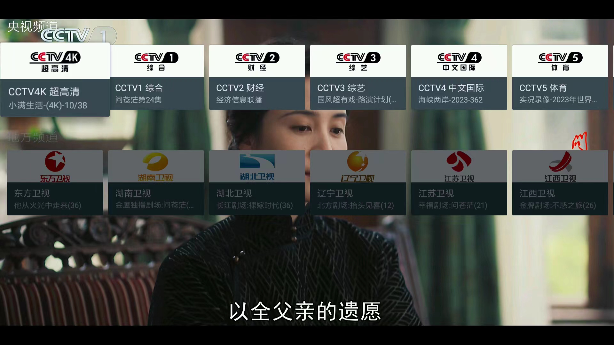
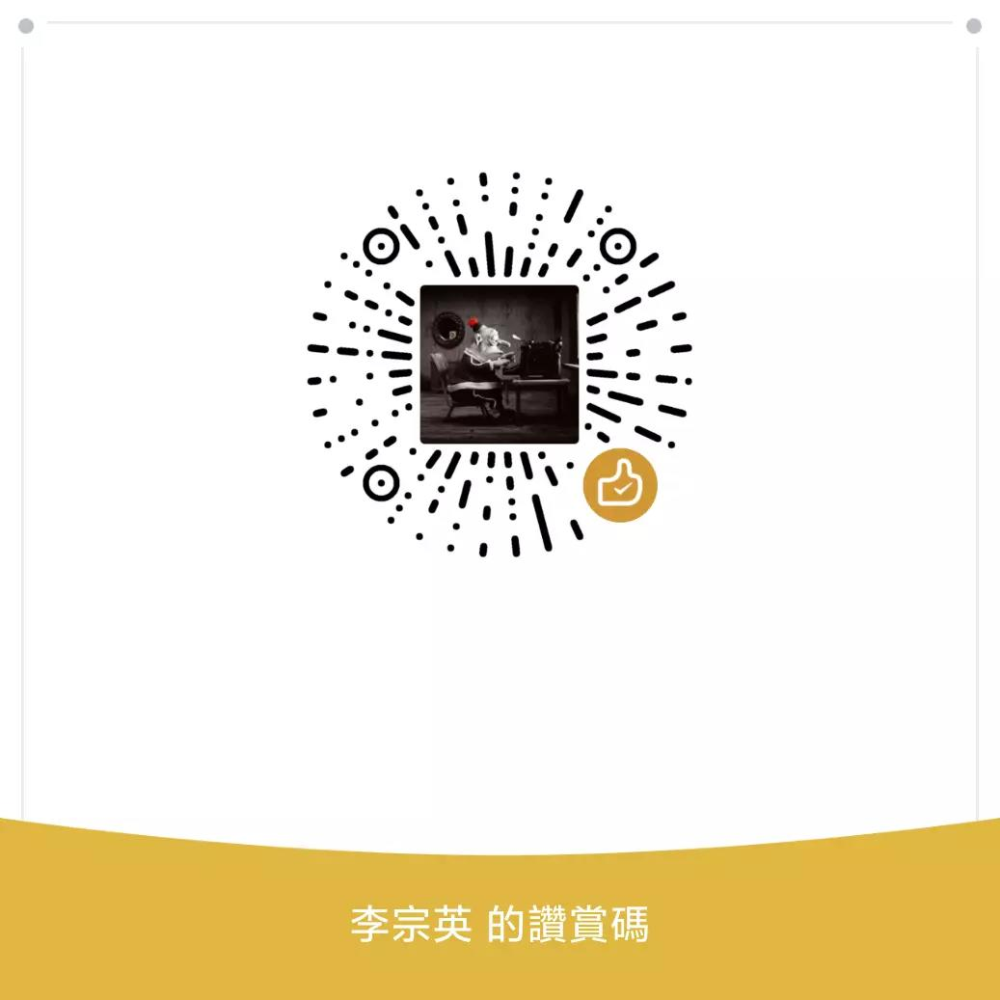

# 我的电视

电视直播软件，安装即可使用

## 使用

1. 下载
    * [github](https://github.com/lizongying/my-tv/releases/)
    * [gitee](https://gitee.com/lizongying/my-tv/releases/)
2. 安裝
    * U盘安装
    * 小米电视可以使用小米电视助手进行安装
    * 如电视可以启用ADB，也可以通过ADB进行安装
       ```shell
       adb install my-tv.apk
       ```




## 更新日志

[更新日志](./HISTORY.md)

## TODO

* 音量不同
* 大湾区卫视、广东4k超高清、广东珠江、三沙卫视
* CHC高清三个电影频道
* 地方频道
* 收藏夹
* 海外
* 隐藏频道
* 亮度调节
* 音量调节
* 軟解
* 自動更新

無法自啟的設備：
斐讯N1盒子，[Phicomm] Phicomm p230 (Android 7.1.2)

閃退：
中国移动盒子(新魔百和M302A) 4.4.2

## 版权说明

[LICENSE](./LICENSE)

本项目仅供学习研究，禁止用于商业用途，请于下载二十四小时内删除。

本项目可能随时终止，请大家谨慎使用，建议使用官方渠道进行观看。

本项目使用的部分代码、图片、文字等资源来源于网络，如有侵权，请联系删除。

## 赞赏

